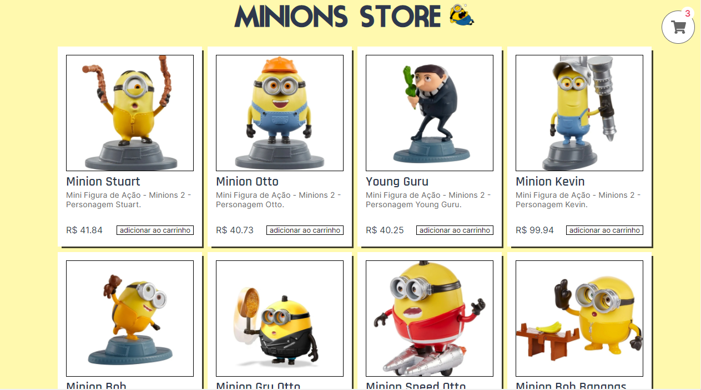

# Simple Commerce



> Um responsivo *serverless* comercio digital simples, com listagem dos produtos, carrinho de compras com indicação da quantidade, modal para carrinho de compras que lista os produtos selecionados podendo assim acrescentar, decrementar ou remover produtos e o formulário para finalizar o pedido chamando o serviço *serverless* para disparar o email do pedido.

[Confira - Ir para o site](http://minionstore.s3-website-sa-east-1.amazonaws.com/).

## 💻 Pré-requisitos

Antes de começar, verifique se você atendeu aos seguintes requisitos:
<!---Estes são apenas requisitos de exemplo. Adicionar, duplicar ou remover conforme necessário--->
* Você instalou a versão mais recente de `npm ou yarn`
* Você instalou a versão mais recente de `node`
* Você instalou a versão mais recente de `serverless framework (https://www.serverless.com/framework/docs/getting-started/)`
* Ter uma conta AWS para utilizar os serviços gratuitos `http://aws.amazon.com/`

## 🚀 Instalando o projeto

Para instalar o simple commerce, siga estas etapas:

Clone o repositório na sua maquina:
```
git clone git@github.com:devNatron/simple-commerce.git
```
Navegue até a pasta do projeto e instale as dependências:
```
cd simple-commerce
cd serverless
npm install

cd ..
cd client
npm install
```

Configurando back-end *serverless*:

Adicionando as credenciais AWS ao Serverless framework:
```
serverless config credentials --provider aws --key YOUR_AWS_USER_KEY --secret YOUR_AWS_USER_SECRET_KEY
```

Arquivo serverless.yaml: Você encontra as configurações podendo alterar nome do projeto e bucket que sera criado na AWS etc..

Arquivo mailer.js: Está a função lambda em nodejs para disparar os emails, este arquivo utiliza variaveis de ambiente para configurar o SMTP.
na pasta do projeto serveless configure o arquivo .env com as informações do SMTP do seu provedor de email, existe um .env.example para ajudar.

serverless/.env
```
SMTP_HOST=
SMTP_PORT=
SMTP_USER=
SMTP_PASS=
```

## ☕ Usando o projeto

Para usar o simples commerce, siga estas etapas:

Usando o backend:

Deploy:
```
cd simple-commerce
cd serverless
serverless deploy -v
```

Qualquer problema remova o projeto da AWS usando:
```
serverless remove
```

Configurando frontend:

Para o frontend utilizar o disparador de emails no arquivo client/.env e necessário configurar a variavel de ambiente com a URL gerada no deploy do serverless framework do nosso serviço mailer, existe um .env.example para ajudar.

client/.env
```
REACT_APP_MAILER_URL=
```
- Caso não queira utilizar o disparador comente seu uso na função *checkOut* no arquivo *ShoppingCartContext*

Usando o frontend:

Iniciando em modo desenvolvedor:
```
cd simple-commerce
cd client
npm start
```

## 📝 Licença

Esse projeto está sob licença. Veja o arquivo [LICENÇA](LICENSE.md) para mais detalhes.

[⬆ Voltar ao topo](#simple-commerce)<br>
